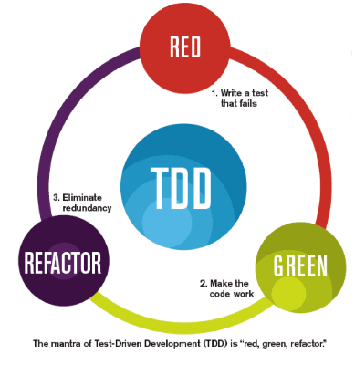
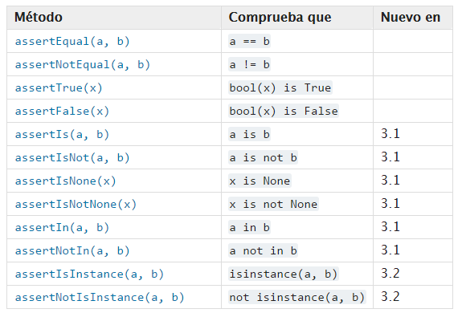

# TDD - Test-Driven Development

TDD en resumen es el proceso de implementación del código donde escribimos primero las pruebas, revisamos si fallan, vamos a verlas fallar y luego escribimos el código para hacer que pasen las pruebas.

En tres pasos es:

1. Red: Write a failing unit test
2. Green: Make the unit test pass
3. Refactor: Eliminate redundancy



> Repita este proceso para cada función, según sea necesario.

En python tenemos muchos paquetes para pruebas, acá algunos:

- pytest
- unittest

## UnitTest

El módulo unittest, a veces referido como PyUnit, forma parte de una serie de frameworks conocidos como xUnit. Estas librerías se encuentran en la mayoría de lenguajes y son casi un estándard a la hora de programar pruebas unitarias.

[Documentación de la librería](https://docs.python.org/3/library/unittest.html)

una prueba puede devolver una de las siguientes respuestas

- `OK`: La prueba fue exitosa
- `FAIL`: La prueba no paso
- `Error`: El código de prueba fallo por un error de desarrollo, ej: División por cero

### Excepciones Asertivas

Los `Assert`  son casos de prueba definidos por la clase `unittest.TestCase`. Se ejecutan todas las funciones que inicien con `test_***`.

Algunos de los métodos más usados de unittest en python son:



### Preparación y Limpieza

La clase `unittest.TestCase` incorpora dos métodos extra:

- `setUp()`: Sirve para preparar el contexto de las pruebas (pre requisitos), *por ejemplo* crear un objeto de la clase `MiClase`, o establecer paramétros de conexión a un servidor.
- `tearDown()`: Sirve para setar los valores definidos en `setUp`, *por ejemplo* destruir el objeto de la clase o cerrar la conexión al servidor.

> Las pruebas se ejecutan en una base de datos independiente creada por unittest y se destruye al finalizar las pruebas.

### Unittest y Django

Para django tenemos diferentes conjuntos de pruebas, entre ellas:

- Pruebas sobre modelos
- Pruebas sobre urls
- Pruebas sobre vistas
- Pruebas sobre formularios

### Sobre este repo

Contiene dos carpetas *basic* y *django_tdd*, la primera contiene una compilación de muchos ejemplos de casos de prueba. La segunda contiene un proyecto de django creado usando la filosofia tdd.

#### Funcionamiento

Para ejecutar los test (ubicados en el directorio basic) escribimos:

##### opcion 1

> `python -m unittest -v basic_test.py`

```bash
$ python -m unittest -v basic_test.py
test_factorial (basic_test.TestFixture) ... ok
test_count (basic_test.TestStringMethods) ... ok
test_isupper (basic_test.TestStringMethods) ... ok
test_split (basic_test.TestStringMethods) ... ok
test_upper (basic_test.TestStringMethods) ... ok

----------------------------------------------------------------------
Ran 5 tests in 0.000s

OK
Preparando el contexto de la prueba
limpiando el contexto
```

#### opcion 2

Funciona solo si llamo a la clase desde el main: `unittest.main()`

> `python test/test_calculator.py`

### Links de consultados

Aparte de la documentación oficial, los siguientes enlaces fueron de mucha ayuda:

- [Beginning Test-Driven Development in Python](https://code.tutsplus.com/tutorials/beginning-test-driven-development-in-python--net-30137)
- [Curso Udemy python - Hector Costa](https://github.com/hcosta/curso-python-udemy/blob/master/Fase%204%20-%20Temas%20avanzados/Tema%2016%20-%20Documentaci%C3%B3n%20y%20Pruebas/Lecci%C3%B3n%2004%20(Apuntes)%20-%20Unittest.ipynb)
