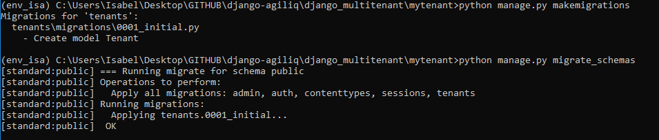
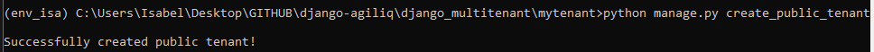
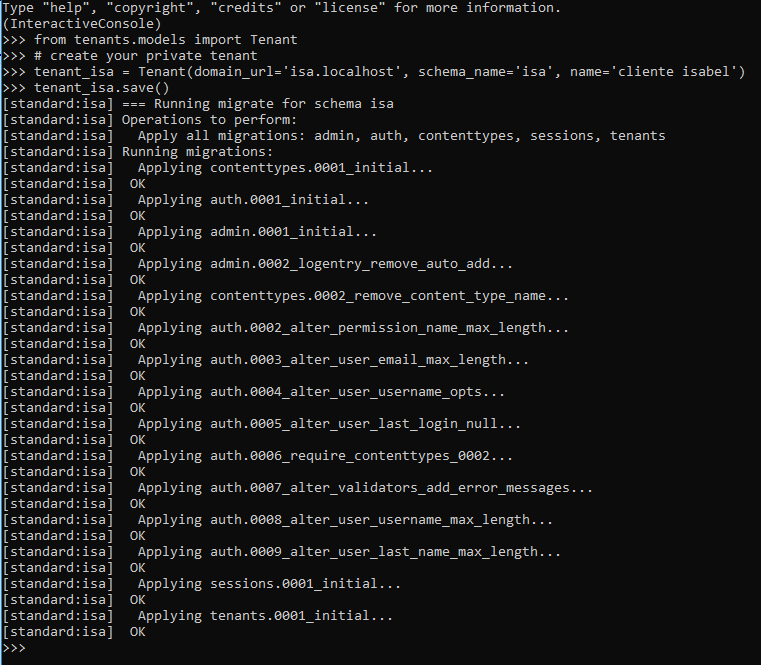
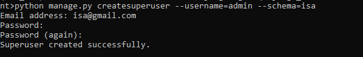
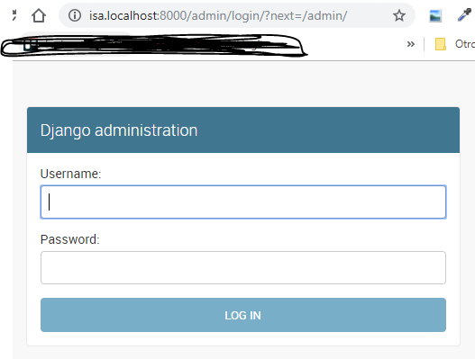

# Django Multitenant

Vamos a reconstruir una aplicación para que sea una aplicación Multitenant. Usaremos la aplicación de encuestas de Django ligeramente modificada como nuestra base.

Existen múltiples enfoques para la multitenant. Los cuatro más comunes son:

1. Shared database with shared schema
2. Shared database with isolated schema (Vamos a usar este enfoque)
3. Isolated database with a shared app server
4. Completely isolated tenants using Docker

## Base de datos compartida con esquema aislado

Una sola base de datos mantiene los datos de cada inquilino. Los datos de cada inquilino están en un esquema separado dentro de la base de datos única. El esquema identifica al arrendatario y los datos presentados no tienen un FK para el arrendatario.

## Fuente

- [Documentación oficial](https://books.agiliq.com/projects/django-multi-tenant)
- [Platzi](https://platzi.com/blog/multi-tenant-que-es-y-por-que-es-importante/)

## Notas

- Usaremos `polls.local` como el dominio principal y `<xxx>.polls.local` como subdominio del arrendatario.
- Para ambiente de desarrollo agregar los siguientes host al archivo `/etc/hosts` (Si estas en windows la ruta suele ser `C:\Windows\System32\Drivers\etc\hosts`). Ejemplo para los dominios:

- thor.example.com
- loki.example.com
- potter.example.com

Adicionar:

```bash
# ...
127.0.0.1 polls.local
127.0.0.1 thor.polls.local
127.0.0.1 potter.polls.local
```

## Pasos

Para ejecutar este proyecto debes:

1. Crear una base de datos postgresl y su rol
2. Crear migraciones: `python manage.py makemigrations`. Este paso es opcional si tienes varias apps y quieres migrarlas por separado
3. Migrar esquemas con tenant: `python manage.py migrate_schemas`
 
4. Crear tenant publico: `python manage.py create_public_tenant`
 
 Crear tenant para un cliente:
 
5. Crear superusuario para un tenant especifico: `python manage.py createsuperuser --username=admin --schema=customer1`
 
6. Ejecutar servidor: `python manage.py runserver`
7. Ir al tenant y verificar que funciona
 